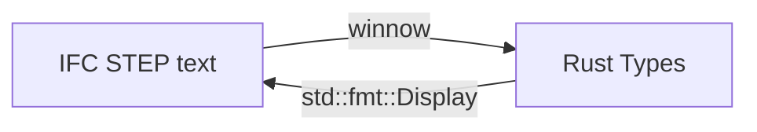

# IFC4

🚧🚧 This crate is still work in progress. The API will most likely change a lot in the future. Use at your own risk! 🚧🚧

# Current functionality

- A parser for a subset of the IFC4 STEP format
- Some builders to create geometric elements in IFC4 STEP format files

# Current Architecture

# Docs

## Standard Docs 

- [IFC4.3 (most recent)](https://ifc43-docs.standards.buildingsmart.org/)
- [IFC4.2](https://standards.buildingsmart.org/IFC/DEV/IFC4_2/FINAL/HTML/)
- [IFC Checker](https://validate.buildingsmart.org/)

## Other

- [Minimal File with a Wall for Starters](https://standards.buildingsmart.org/IFC/DEV/IFC4_2/FINAL/HTML/annex/annex-e/wall-standard-case.ifc)
- [Autodesk Viewer (Main Target for importing IFC files for now)](https://viewer.autodesk.com/)
- [Other detailed example files](https://www.ifcwiki.org/index.php?title=KIT_IFC_Examples)
