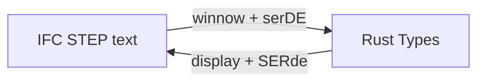

# IFC4

A parser for the IFC4 format

# Current Architecture

```mermaid
graph LR

ifc[IFC STEP text]
rust[Rust Types]

ifc --> |winnow + serDE| rust
rust --> |display + SERde| ifc
```

# Docs

- [IFC4](https://standards.buildingsmart.org/IFC/DEV/IFC4_2/FINAL/HTML/)
