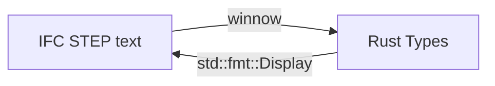

# IFC4

A parser for the IFC4 format

# Current Architecture

# Docs

- [IFC4](https://standards.buildingsmart.org/IFC/DEV/IFC4_2/FINAL/HTML/)
- [Minimal File for Starters](https://standards.buildingsmart.org/IFC/DEV/IFC4_2/FINAL/HTML/annex/annex-e/wall-standard-case.ifc)
- [Autodesk Viewer (Main Target for now)](https://viewer.autodesk.com/)
- [New detailed example files](https://www.ifcwiki.org/index.php?title=KIT_IFC_Examples)
